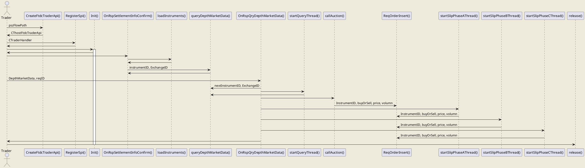

# flow

## main flow

```flow
st=>start: new loop
wait=>operation: wait till auction start time
init=>operation: Init()
queryIns=>operation: queryDepthMarketData
onRespQueryIns=>operation: OnRspQryDepthMarketData
findNextIns=>operation: findNextInstrumentToQuery
void=>operation: void
isBackgroundQuery=>condition: isBackgroundQuery
isLastInFirstRound=>condition: isLastInFirstRound
backgroundQuery=>operation: beginBackGroundQuery
beginAuction=>operation: call Auction
backgroundSlippery=>operation: beginBackgroundSlippery

e=>end: release

st->wait->init->queryIns->onRespQueryIns->isBackgroundQuery
isBackgroundQuery(yes)->void
isBackgroundQuery(no)->isLastInFirstRound
isLastInFirstRound(yes)->backgroundQuery->beginAuction->backgroundSlippery
isLastInFirstRound(no)->findNextIns->queryIns

```

## auction flow

```flow
st=>start: start auction
findNextIns=>operation: find next Instrument to submit
composeOrder=>operation: compose auction order
submitOrder=>operation: insert auction order without waiting
recordOrder=>operation: record order into auctionInsStateMap
isLastOne=>condition: is last order to submit
e=>end: finish auction

st->findNextIns->composeOrder->submitOrder->recordOrder->isLastOne
isLastOne(yes)->e
isLastOne(no)->findNextIns
```

## slippery pahse 1 flow

quite familiar with auction flow

```flow
st=>start: called by main thread
wait=>operation: sleep till start time
findNextIns=>operation: find next Instrument to submit
composeOrder=>operation: compose slippery order, volumn=1 everytime
submitOrder=>operation: insert slippery order after getting lock
recordOrder=>operation: record order into slipperyInsStateMap
isLastOne=>condition: is last order to submit
e=>end: finish this phase

st->wait->findNextIns->composeOrder->submitOrder->recordOrder->isLastOne
isLastOne(yes)->e
isLastOne(no)->findNextIns
```

## slippery pahse 2 flow

```flow
st=>start: called by main thread
wait=>operation: sleep till start time
findNextIns=>operation: find Instrument to submit
iterateOrder=>operation: iterate orders of each instrument
judgeOrderStatue=>condition: is the order state UNTRATED or RETRIVED
composeOrder=>operation: compose slippery order, volumn=1 everytime
submitOrder=>operation: insert auction order after getting lock
recordOrder=>operation: record order into slipperyInsStateMap
isLastOne=>condition: is last order to submit
e=>end: finish this phase

st->wait->findNextIns->iterateOrder->judgeOrderStatue
judgeOrderStatue(yes)->composeOrder->submitOrder->recordOrder->isLastOne
judgeOrderStatue(no)->iterateOrder
isLastOne(yes)->e
isLastOne(no)->findNextIns
```
</br>
## slippery pahse 3 flow

```flow
st=>start: called by main thread
wait=>operation: sleep till start time
foreverloop=>operation: forever loop
setSubmitFlag=>operation: set submitFlag False
findNextIns=>operation: find Instrument to submit
iterateOrder=>operation: iterate orders of each instrument
judgeOrderStatue=>condition: is the order state UNTRATED or RETRIVED
judgeOrderStatue2=>condition: is the order state ORDERED (not TRADED)
cancelOder=>operation: call this oder after getting lock
composeOrder=>operation: compose slippery order, volumn=1 everytime
submitOrder=>operation: insert slippery order after getting lock
updateSubmitFlag=>operation: set submitFlag True
recordOrder=>operation: record order into slipperyInsStateMap
lastOrder=>condition: is last order of this instrument
lastIns=>condition: is last Instrument
hasOrderSubmit=>condition: Is submitFlag True after this loop
e=>end: finish this phase

st->wait->foreverloop->setSubmitFlag->findNextIns->iterateOrder->judgeOrderStatue
judgeOrderStatue(yes)->composeOrder->submitOrder->updateSubmitFlag->recordOrder->lastOrder
judgeOrderStatue(no)->judgeOrderStatue2
judgeOrderStatue2(no)->iterateOrder
judgeOrderStatue2(yes)->cancelOder->updateSubmitFlag
lastOrder(no)->iterateOrder
lastOrder(yes)->lastIns
lastIns(no)->findNextIns
lastIns(yes)->hasOrderSubmit
hasOrderSubmit(no)->e
hasOrderSubmit(yes)->foreverloop
```

## slippery scan flow


# UML

not totally correct UML. I dont know how to represent callback function in UML

